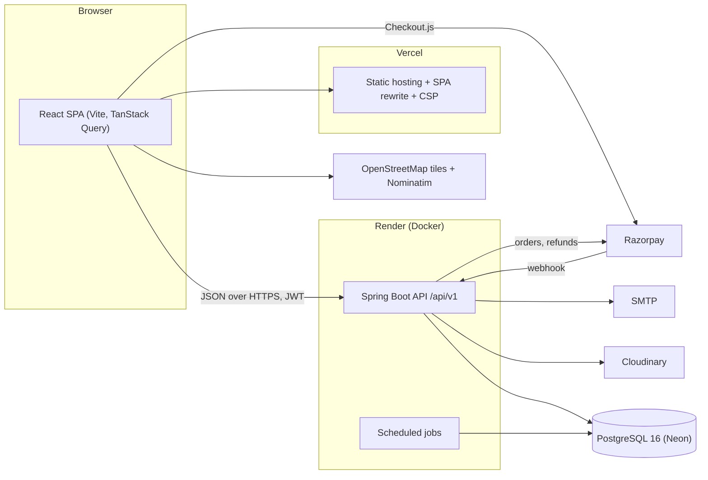

# ParkEase — Smart Parking Slot Rental & Availability Platform

[](https://github.com/xreep/Parkease/actions/workflows/ci.yml)

ParkEase is a two-sided marketplace where private parking owners rent out unused slots and drivers find, reserve and pay for parking in advance, near metro stations, office complexes and commercial hubs across India. An admin team verifies owners and listings, monitors bookings, resolves disputes, marks payouts and reads reports.

It is the implementation of the Unified Mentor project **"Smart Parking Slot Rental & Availability Platform"** (project id 11778), plus a few additions agreed beyond the brief: real Razorpay test-mode payments with refunds, in-app and email notifications, reviews and ratings, and all-India location data.

- **Live demo:** add the Vercel URL here once deployed (see [docs/DEPLOYMENT.md](docs/DEPLOYMENT.md)).
- **Design spec:** [docs/superpowers/specs/2026-10-04-smart-parking-design.md](docs/superpowers/specs/2026-10-04-smart-parking-design.md) (decisions per phase in sections 17 to 23)
- **Architecture:** [docs/ARCHITECTURE.md](docs/ARCHITECTURE.md) · **Project report:** [docs/PROJECT_REPORT.md](docs/PROJECT_REPORT.md)
- **API docs:** Swagger UI at `http://localhost:8080/swagger-ui` while the backend runs.

## Features

### Drivers

- Search by place, date/time window and vehicle type on a clustered map and list; filter by distance, price, listing type, amenities and 24 x 7; sort by distance, price or rating.
- Listing pages with photos, opening hours, rules, cancellation policy, a 90-day availability calendar, reviews, and a live price quote (parking + platform fee + GST).
- Reserve a slot (held for 10 minutes while paying), pay through Razorpay Checkout (or the built-in mock provider), get a booking page with a QR code, status timeline and a PDF receipt.
- Cancel with the refund shown before confirming; owner-approval bookings are refunded in full if the owner declines or does not answer.
- Vehicles, payments and receipts, bookings tabs (Upcoming / Active / Past / Cancelled), personal stats, notifications (in-app bell and email), reviews after a completed booking, and "Report a problem" disputes.
- Light and dark theme, responsive down to 375 px.

### Owners

- Registration, identity verification (document upload, reviewed by an admin) and payout details.
- A six-step listing wizard: location pin, photos, slots, pricing and rules, weekly schedule, submit for review. Pause and resume, blocked times, advisory price guidelines per city tier.
- Booking requests (approve or decline with a reason), upcoming bookings (cancel with a reason), and a week calendar of slots, bookings and blocks.
- Dashboard: earnings, bookings, occupancy, rating and pending approvals over 7 / 30 / 90 days with charts; earnings ledger with CSV export; held, pending-payout and paid balances; review replies; dispute responses.

### Admins

- KPI overview (users, listings, conversion, utilization, GMV, revenue, refunds, top states and cities, daily trends).
- Review queues for owner verification and listing approval; user suspension and activation; listing suspension; review moderation; state and city management.
- Bookings monitor with payment, refund and timeline detail, and admin cancellation with a full refund.
- Disputes (open, under review, resolved with a full or partial refund, no refund, or a warning); payments and refunds with retry of failed refunds; owner payouts (mark paid with a reference, CSV of the pending list).
- Usage and revenue reports per city with CSV export; platform settings (fee, GST, hold and approval timing, price guidelines); an audit log of every admin action.

## Tech stack

| Layer | Technology |
|---|---|
| Backend | Java 21, Spring Boot 4.1 (Spring Framework 7, Spring Security 7, Hibernate 7), Maven wrapper |
| API | REST under `/api/v1`, RFC 7807 problem responses, springdoc-openapi (Swagger UI) |
| Database | PostgreSQL 16 (`btree_gist` exclusion constraint), Flyway migrations (V1 to V17) |
| Auth | JWT access (15 min) and rotating refresh tokens (7 days, stored hashed), BCrypt, Bucket4j rate limits |
| Integrations | Razorpay (orders, signature checks, webhooks, refunds), Cloudinary, SMTP via Spring Mail with Thymeleaf templates, OpenPDF receipts. Each has a local fallback (mock payments, local disk, console email) |
| Frontend | React 19, Vite, TypeScript, Tailwind CSS v4, React Router, TanStack Query, React Hook Form + Zod, Axios |
| Maps | React-Leaflet, OpenStreetMap tiles, marker clustering, Nominatim geocoding |
| Tests | JUnit 5, Spring Boot Test + MockMvc on a real PostgreSQL; Vitest, React Testing Library, axe-core |
| CI / hosting | GitHub Actions; Render (Docker) + Neon + Vercel + Cloudinary |

## Architecture



The backend is a modular monolith, one package per feature under `com.smartparking`. More detail, including the booking, payment and refund sequence, is in [docs/ARCHITECTURE.md](docs/ARCHITECTURE.md).

## Screenshots

Screenshots are not committed yet. To add them, run the app with the demo data (below), take the following at about 1440 x 900 (and the mobile ones at 375 px), save them under `docs/screenshots/` and they will show here.

| File | Should show |
|---|---|
| `docs/screenshots/home.png` | Home page: search hero, popular cities, browse by state |
| `docs/screenshots/search.png` | Search results with filters, list and clustered map |
| `docs/screenshots/listing.png` | Listing page: gallery, availability calendar, booking card with a live quote |
| `docs/screenshots/checkout.png` | Checkout with the price breakdown and the hold countdown |
| `docs/screenshots/booking.png` | Booking page with the QR code and status timeline |
| `docs/screenshots/driver-bookings.png` | Driver "My parking" bookings tabs |
| `docs/screenshots/owner-dashboard.png` | Owner overview with KPIs and charts |
| `docs/screenshots/owner-wizard.png` | Listing wizard (location pin or pricing step) |
| `docs/screenshots/owner-calendar.png` | Owner week calendar with bookings and blocks |
| `docs/screenshots/admin-overview.png` | Admin KPI dashboard |
| `docs/screenshots/admin-disputes.png` | Admin dispute resolution or payouts page |
| `docs/screenshots/mobile-search.png` | Search on a 375 px screen, dark theme |

## Run locally

Requirements: **Java 21**, **PostgreSQL 16**, **Node 22** (see `frontend/.nvmrc`).

```bash
# macOS
brew install openjdk@21 postgresql@16 node
brew services start postgresql@16
createdb smartparking_dev
createdb smartparking_test
```

Add to `~/.zshrc`:

```bash
export JAVA_HOME="$(brew --prefix openjdk@21)"
export PATH="$JAVA_HOME/bin:$(brew --prefix postgresql@16)/bin:$PATH"
```

Backend (port 8080, `dev` profile; Flyway creates the schema and the seeders fill demo data on first start):

```bash
cd backend
./mvnw spring-boot:run
```

Frontend (port 5173, proxies `/api` to the backend):

```bash
cd frontend
npm install
npm run dev
```

Open http://localhost:5173.

Every setting is an environment variable with a development default, so nothing is required locally. To change any, copy [`backend/.env.example`](backend/.env.example) to `backend/.env` (git-ignored) and run `set -a && source .env && set +a && ./mvnw spring-boot:run`. The frontend's [`.env.example`](frontend/.env.example) has `VITE_API_URL` (empty in development) and `VITE_PUBLIC_URL`. Never commit real secrets.

### Demo data and accounts (dev profile)

The `dev` profile seeds, idempotently and deterministically, all 36 states and union territories with more than 100 cities, about 100 demo listings (at least one in every state and UT), about 30 owners (a few waiting for verification), about 50 drivers with vehicles, and about 500 bookings from 90 days back to 14 days ahead in every status, with matching payments, refunds, invoices, earnings (some paid out), reviews (some with owner replies, one hidden), disputes in each state, notifications and audit rows. The seed is designed to finish in under 30 seconds and never touches data it did not create.

Sign in with these accounts, all with password **`Demo@1234`** (change it with `DEMO_PASSWORD` before the accounts are first created):

| Role | Email |
|---|---|
| Admin | `admin@parkease.dev` |
| Owner (verified, has the most activity) | `owner@parkease.dev` |
| Owners (verified, regional) | `owner.north@`, `owner.south@`, `owner.east@`, `owner.northeast@`, `owner.central@` `parkease.dev` |
| Owner (pending verification) | `owner.pending@parkease.dev` |
| Driver | `driver@parkease.dev` |

The generated owners and drivers use `@example.com` addresses and the same password; list them under **Admin → Users**. The pending owner and a pending listing ("Viman Nagar Residency Parking") appear in the admin review queues, so the approval flow can be tried straight away.

A hosted demo uses the opt-in `demo` profile (`SPRING_PROFILES_ACTIVE=prod,demo`) and **requires** `DEMO_PASSWORD`; it refuses to start without one.

### Try the main flows

1. **Find parking:** search "Andheri Metro" or pick Pune; choose a window and vehicle; open a listing.
2. **Book:** sign in as `driver@parkease.dev`, press Reserve, pay with the mock test payment. The slot is held for 10 minutes while you pay.
3. **Owner side:** sign in as `owner@parkease.dev` for requests, earnings and the calendar. Listings that need approval show "Waiting for owner" to the driver.
4. **Cancel:** open a confirmed booking and press Cancel; the refund is shown first.
5. **Admin:** sign in as `admin@parkease.dev` for KPIs, queues, disputes and payouts.

### Cancellation policy

When a driver cancels a confirmed booking, the refund is a share of the **parking charge**; the platform fee and GST are not refunded. A request the owner has not accepted yet is refunded in full, and so are owner cancellations and requests that expire or are declined.

| Policy | Full refund | Half refund | No refund |
|---|---|---|---|
| Flexible | Up to 1 hour before the start | Within 1 hour of the start | n/a |
| Moderate | Up to 24 hours before the start | 2 to 24 hours before the start | Within 2 hours of the start |
| Strict | n/a | Up to 48 hours before the start | Within 48 hours of the start |

A booking that has started cannot be cancelled by the driver.

## Payments

Payments use a **mock provider by default**: checkout shows a "test payment" dialog and needs no account. For real Razorpay Checkout in test mode, create a Razorpay account, switch the dashboard to **Test mode**, generate keys and set them in `backend/.env`:

```bash
RAZORPAY_KEY_ID=rzp_test_xxxxxxxx
RAZORPAY_KEY_SECRET=xxxxxxxx
```

With both set the backend switches to Razorpay on its own; remove them to return to the mock. Test card `4111 1111 1111 1111` (any future expiry, any CVV) or UPI `success@razorpay`. Webhooks (`RAZORPAY_WEBHOOK_SECRET`, `POST /api/v1/payments/webhook`) need a public URL, so they come with deployment; until then a payment is confirmed when the browser verifies it after checkout, and a reconciliation job catches payments whose confirmation never arrived.

The mock provider is switched off in `prod`, which refuses to start without Razorpay keys. ParkEase never moves payout money: admins record the transfer reference themselves.

Money split: the driver pays `base + platform fee (10% of base) + GST (18% of the fee)`; the owner earns the full base. The fee, GST, and the hold and approval timing are admin settings and apply to new bookings only.

## Testing

```bash
cd backend && ./mvnw test                 # needs PostgreSQL; uses the smartparking_test database
cd frontend && npm run lint && npx tsc -b && npm test -- --run && npm run build
```

- **Backend:** 903 tests (JUnit 5, MockMvc integration tests against a real PostgreSQL, because the double-booking guarantee is an exclusion constraint that H2 cannot model).
- **Frontend:** 854 Vitest tests (React Testing Library, `axios-mock-adapter`), including axe-core accessibility checks of the key pages.
- **CI:** [GitHub Actions](.github/workflows/ci.yml) runs the backend suite on a PostgreSQL 16 service, the frontend lint, type check, tests and build, and a non-blocking dependency audit on every push and pull request; Dependabot checks weekly.

## Deployment

The target is free tiers of Render (backend Docker image), Neon (PostgreSQL), Vercel (frontend), Cloudinary (images) and any SMTP provider, with Razorpay in test mode. Step-by-step instructions, the post-deploy smoke checklist and troubleshooting (including free-tier cold starts) are in **[docs/DEPLOYMENT.md](docs/DEPLOYMENT.md)**. Deployment files: `render.yaml`, `backend/Dockerfile`, `frontend/vercel.json`.

## Security summary

- JWT access tokens (15 minutes) and single-use rotating refresh tokens stored hashed; BCrypt (strength 12); role checks on routes and ownership checks in services; suspended users are cut off within about a minute.
- Per-IP rate limits: auth endpoints, public reads (120 per minute), uploads and disputes (20 per minute), payment verification (30 per minute), answered with `429` and `Retry-After`; request body size limits.
- Server-side pricing only; Razorpay signatures verified on verify and webhook calls, with amount, currency and order checked; refunds are idempotent; uploads validated by magic bytes and size; private documents only through short-lived signed links.
- Security headers on the API (frame deny, `nosniff`, referrer and permissions policies, HSTS in prod) and a Content-Security-Policy on the frontend host; CORS allow-list from the environment; no stack traces in errors; the actuator exposes only `health`.
- The `prod` profile refuses to start with a weak or missing `JWT_SECRET`, no database or CORS origin, or without Razorpay keys. Secrets live only in environment variables; `.env` files are git-ignored.

## Project structure

```
backend/                  Spring Boot API, package-by-feature under com.smartparking
  src/main/java/...       auth, user, owner, vehicle, location, listing, slot, availability, search,
                          pricing, booking, payment, invoice, earning, notification, email, review,
                          dispute, admin, settings, storage, common (security, errors, config, seed)
  src/main/resources/     application*.yml, db/migration (Flyway V1 to V17), seed data
  src/test/               unit and integration tests, shared test support
  Dockerfile  .env.example
frontend/                 React single-page app (Vite, TypeScript)
  src/pages/              public, driver, owner and admin pages (lazy loaded per route)
  src/components/         shared UI, search, listing, owner, admin, charts
  src/lib/                API client and data hooks, formatting, time helpers
  vercel.json  .env.example
docs/                     ARCHITECTURE.md, PROJECT_REPORT.md, DEPLOYMENT.md, spec and phase plans
.github/                  CI workflow and Dependabot config
render.yaml               Render blueprint
```

## License

No license file is included: all rights reserved by the author. The project was built as a learning and portfolio submission; contact the repository owner before reusing it.
