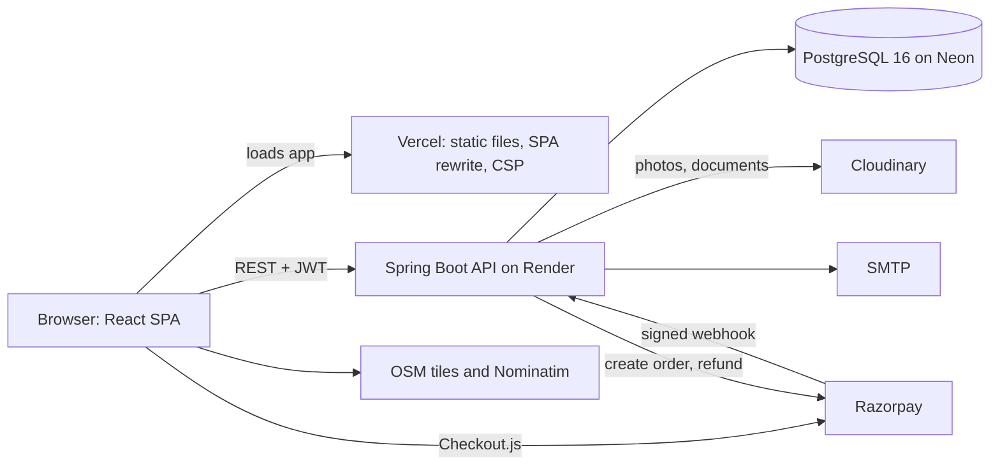
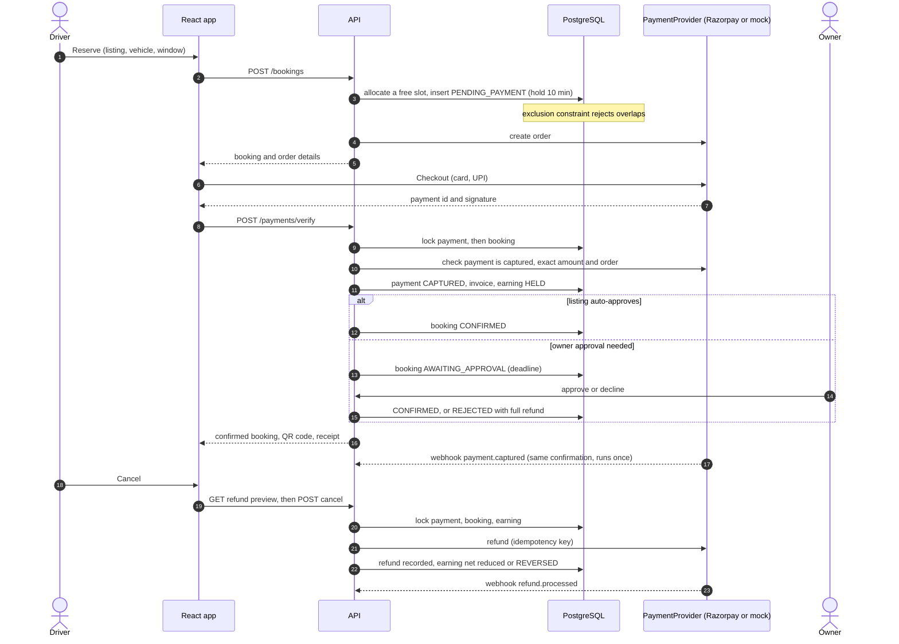
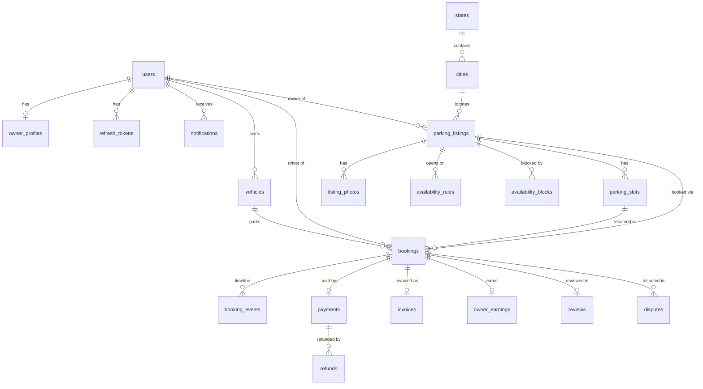

# ParkEase architecture

ParkEase is a single-page React application talking to one Spring Boot API that owns a PostgreSQL database. This document describes how the backend is organised, how the key flows work, and the rules that keep money and bookings correct. For the decisions behind them see sections 2 to 23 of the [design spec](superpowers/specs/2026-10-04-smart-parking-design.md).

## 1. System overview

It is a modular monolith: one deployable, one database, one process. Background jobs run inside the same process, which is why the application is designed for a single instance (see section 9).

## 2. Backend modules

One package per feature under `com.smartparking`; each owns its controller, service, repository, entities and DTOs.

| Package | Responsibility |
|---|---|
| `auth`, `user` | Registration, login, refresh, email verification, password reset, profile; users and roles |
| `owner` | Owner profile, verification submission, payout details, owner dashboard stats, earnings and calendar views |
| `vehicle` | Driver vehicles |
| `location` | States and cities (read API and admin management), city tiers |
| `listing`, `slot` | Parking listings and their lifecycle (draft, review, approved, paused, suspended), photos, amenities, slots |
| `availability` | Weekly opening hours, blocked times, the evaluator that decides whether a slot is free for a window, and the public availability calendar |
| `search` | Candidate query (bounding box then Haversine), window and slot evaluation, sorting, paging |
| `pricing` | Quotes: cheapest of hourly, daily, monthly and mixed pricing, platform fee and GST |
| `booking` | Slot allocation, booking creation and state changes, owner decisions, cancellations and refund policy, lifecycle jobs, row-lock helper |
| `payment` | `PaymentProvider` (Razorpay or mock), verify and webhook handling, refunds, reconciliation |
| `invoice` | PDF receipts (OpenPDF), generated on download |
| `earning` | Owner earnings ledger and payout state |
| `notification`, `email` | In-app notifications and email, behind one `Notifier` facade |
| `review` | Reviews, owner replies, rating aggregates |
| `dispute` | Disputes, owner responses, admin resolutions |
| `admin`, `settings` | Admin queues, moderation (users, listings, reviews, locations), bookings monitor, payments, payouts, KPIs and reports (`admin/reports`), audit log (`admin/audit`); platform settings |
| `storage` | `FileStorage` (Cloudinary or local disk), upload validation, signed private links |
| `common` | Security configuration, rate limiting, error handling, base entity, time utilities, demo seeders |

Pluggable providers are chosen by configuration: `PaymentProvider` (`RazorpayPaymentProvider` when `RAZORPAY_KEY_ID` and `RAZORPAY_KEY_SECRET` are set, otherwise `MockPaymentProvider`), `EmailSender` (`SmtpEmailSender` when `MAIL_HOST` is set, otherwise `LoggingEmailSender`) and `FileStorage` (Cloudinary when `CLOUDINARY_URL` is set, otherwise local disk).

The frontend mirrors the roles: lazily loaded pages under `/driver`, `/owner` and `/admin`, guarded by `RequireRole`, with TanStack Query for server state and one Axios client that attaches the access token and refreshes it once on a 401.

## 3. Request flow

1. The SPA calls `/api/v1/...` with `Authorization: Bearer <access token>`.
2. Servlet filters run in order: request size limit, per-IP rate limit (`RateLimitFilter`), then `JwtAuthenticationFilter`, which validates the token and checks the user is still active through a short-lived cache (45 seconds).
3. `SecurityConfig` applies the route rules: `/api/v1/admin/**` needs `ADMIN`, `/api/v1/owner/**` needs `OWNER`, public reads (search, listings, locations) and the payment webhook are open, everything else needs a signed-in user.
4. A controller validates input (Bean Validation) and calls a service. Services enforce ownership ("this booking belongs to this driver") and run in transactions.
5. Errors leave through `GlobalExceptionHandler` as RFC 7807 `ProblemDetail` JSON with a stable `code` (for example `SLOT_UNAVAILABLE`, `HOLD_EXPIRED`, `NOT_CANCELLABLE`) and `fieldErrors`; no stack traces.
6. Notifications and emails are sent after the transaction commits (`AfterCommit`), so a rollback never produces a message.

## 4. Booking, payment and refund

Key points:

- **Hold.** An unpaid booking holds its slot for `hold_minutes` (10). At most three unpaid holds per driver.
- **Verify and webhook share one confirmation path.** Both confirm only a payment of the right order, for exactly the order amount and currency, that is captured at the provider; confirmation runs once per booking. Webhook events are de-duplicated by provider event id.
- **Late or duplicate payments.** A payment captured after the hold lapsed re-confirms the booking if the slot is still free, otherwise it is refunded in full. An extra captured payment on a paid order is refunded in full. A reconciliation job covers payments whose confirmation never reached the server.
- **Approval.** For listings that need approval, the deadline is the earlier of two hours after payment and the start time; a declined, ignored or expired request is refunded in full and the earning is reversed.
- **Refund amounts.** Driver cancellation refunds a share of the base amount by the listing's policy (flexible, moderate, strict); the platform fee and GST are refunded only when the owner, the system or an admin causes the cancellation. Partial refunds are supported (`PARTIALLY_REFUNDED`, `REFUNDED`); the owner earning's `net` follows the refunded base amount.
- **Money split.** Driver pays `base + 10% fee + 18% GST on the fee`; the owner earns the full base. Amounts are computed server-side, stored on the booking, and unaffected by later setting changes.

## 5. Data model overview

Other tables: `email_tokens` (verify email, reset password), `webhook_events` (de-duplication of provider events), `platform_settings` (key/value admin settings and the demo-seed marker), `admin_actions` (audit log), `listing_amenities` (amenities of a listing). Schema changes are Flyway migrations `V1` to `V17` under `backend/src/main/resources/db/migration`; Hibernate only validates (`ddl-auto: validate`).

Main statuses:

- Booking: `PENDING_PAYMENT`, `AWAITING_APPROVAL`, `CONFIRMED`, `ACTIVE`, `COMPLETED`; terminal `CANCELLED`, `REJECTED`, `EXPIRED`. Every transition writes a `booking_events` row, which is the status timeline users see.
- Listing: `DRAFT`, `PENDING_REVIEW`, `APPROVED`, `REJECTED`, `PAUSED`, `SUSPENDED`.
- Payment: `CREATED`, `CAPTURED`, `FAILED`, `PARTIALLY_REFUNDED`, `REFUNDED`. Earning: `HELD`, `PENDING_PAYOUT`, `PAID`, `REVERSED`.

## 6. Concurrency and consistency

- **No double booking.** `bookings` has an exclusion constraint (`btree_gist`): no two rows with the same `slot_id` and overlapping `tstzrange(start_time, end_time)` while the status is `PENDING_PAYMENT`, `AWAITING_APPROVAL`, `CONFIRMED` or `ACTIVE`. The allocator picks a free slot, and if two requests race (SQLState `23P01`) the loser retries on the next free slot; when none is left the API answers `409 SLOT_UNAVAILABLE`. Stale holds are expired before allocation.
- **Lock order.** Every path that touches money takes row locks in the same order: **payment, then booking, then owner earning** (and listing last when a rating is recomputed). `BookingLocks` is the one helper that locks a booking with its payment; the repositories document the order. Verify calls, webhooks, owner decisions, cancellations, refunds, dispute resolutions, payouts and the background jobs all follow it, so they serialise instead of deadlocking, and each re-checks the status after locking, which makes them idempotent.
- **Idempotent refunds.** Refunds carry an idempotency key, so a retry never refunds twice; failed refunds are retried by a job (limited attempts) and manually by an admin.
- **Slot allocation transactions.** Allocation uses its own short transactions so a lost race can retry; creating the provider order is a network call kept outside any open transaction.
- **Settings** are read when a booking is created and stored on it, so changing the fee or GST affects only new bookings.

## 7. Scheduled jobs

Defined in `BookingJobs` and enabled by `app.jobs.enabled` (off in tests).

| Cadence | Job |
|---|---|
| every minute | Expire unpaid holds; auto-decline overdue approval requests with a full refund; move bookings `CONFIRMED` to `ACTIVE` at the start and to `COMPLETED` at the end (earning `HELD` to `PENDING_PAYOUT`); send reminders (driver one hour before the start, owner 30 minutes before an approval deadline), each once |
| every 5 minutes | Reconcile payments for orders from the last hour with the provider |
| every 10 minutes | Retry failed refunds (limited attempts) |
| hourly | Reconcile payments for orders between one and 24 hours old |

The jobs claim work in small batches and re-check state under the lock order above, so a slow or repeated run is harmless.

## 8. Notifications and email

`Notifier` is the single entry point: each important event (booking confirmed, requested, approved, declined, cancelled, refunded, starting soon, completed; owner verified or rejected; listing approved, rejected, suspended; new review; dispute opened, answered, resolved; payout sent; account suspended) creates a row in `notifications` and sends an email. The bell in the navigation bar polls the unread count every 30 seconds while the tab is visible. Emails are HTML (Thymeleaf templates) over SMTP; without SMTP settings they are printed to the console.

## 9. Security model

- **Authentication.** Login returns a 15-minute JWT access token and a 7-day refresh token. Refresh tokens are random values stored only as hashes, rotated on every use and revocable; replaying a rotated token revokes the session. The frontend refreshes once on a 401 under a cross-tab lock.
- **Authorisation.** Route rules by role plus ownership checks in services; a user has exactly one role and admins are seeded only. Suspension revokes refresh tokens and takes effect within about 45 seconds (status cache); suspended owners' listings leave search.
- **Passwords and tokens.** BCrypt strength 12; email verification and password reset tokens are single-use and expire (reset after 30 minutes).
- **Rate limits (per client IP, Bucket4j).** Auth endpoints (except refresh and logout), public reads 120 per minute, uploads and disputes 20 per minute, payment verification 30 per minute; responses are `429` with `Retry-After`. Clients are keyed on `getRemoteAddr()`; behind Render, Tomcat's `RemoteIpValve` (`server.forward-headers-strategy: native`) replaces it with the `X-Forwarded-For` entry only for connections from internal proxies (`server.tomcat.remoteip.internal-proxies`, overridable with `INTERNAL_PROXIES`), so a caller cannot choose its own bucket.
- **Input and uploads.** Bean Validation on all inputs, parameterised JPA queries, JSON body size limit, uploads validated by magic bytes and size (5 MB; photos JPEG, PNG or WebP, documents also PDF). Owner documents are private: they open only through signed links that expire after five minutes.
- **Payments.** Amounts are computed on the server; signatures are verified (HMAC-SHA256) for verify and webhook calls; the provider is asked to confirm capture, order and amount.
- **Headers and CORS.** API: frame deny, `X-Content-Type-Options`, referrer and permissions policies, HSTS in `prod`. Frontend host (`vercel.json`): a Content-Security-Policy allowing only Razorpay Checkout, Cloudinary and OpenStreetMap images, the API on Render and Nominatim, plus the same hardening headers. CORS allows only the configured frontend origin.
- **Production guard.** With the `prod` profile the application refuses to start on a weak, known or missing `JWT_SECRET`, a missing database or CORS origin, or missing Razorpay keys, and reports every problem at once. The actuator exposes only `health`.

## 10. Deployment topology

| Part | Service | Notes |
|---|---|---|
| Frontend | Vercel | Static build of `frontend/`; `vercel.json` provides the SPA rewrite, headers and CSP; `VITE_API_URL` points at the API |
| API | Render web service (Docker) | `backend/Dockerfile`; `SPRING_PROFILES_ACTIVE=prod` (or `prod,demo` for the demo); health check `/api/v1/health` (static, no database access; `/actuator/health` is the readiness check); memory-conscious JVM settings and a pool of five connections |
| Database | Neon PostgreSQL | TLS (`sslmode=require`); Flyway migrates on startup; the role must be able to create `btree_gist` |
| Files | Cloudinary | Render's disk is ephemeral, so uploads belong in Cloudinary in production |
| Payments | Razorpay test mode | Webhook `POST /api/v1/payments/webhook` with its own secret |
| CI | GitHub Actions | Backend tests on a PostgreSQL 16 service, frontend checks, non-blocking audit |

**Single instance by design.** The rate limiter, the user-status cache and the scheduled jobs live in process memory. Running several instances would need a shared store (Redis) for limits and cache and a job lock, which is listed as future work. Step-by-step deployment is in [DEPLOYMENT.md](DEPLOYMENT.md).
